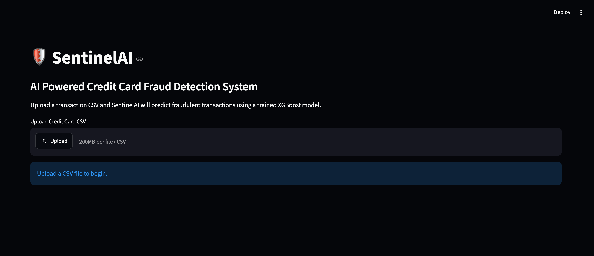
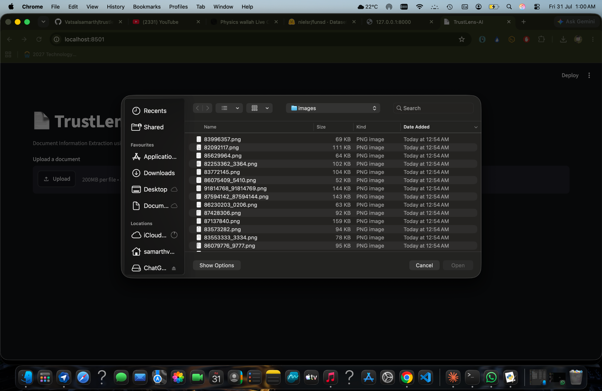
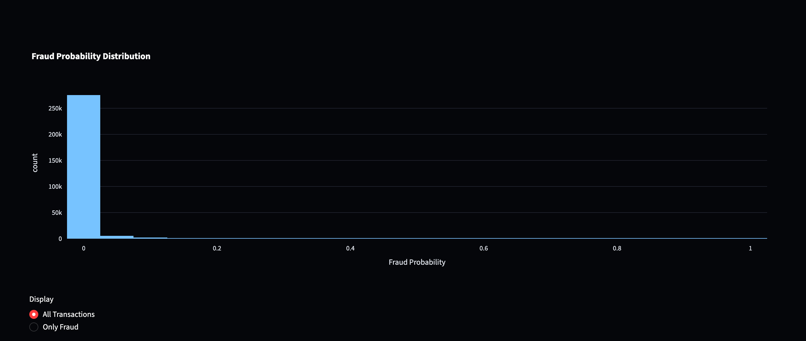
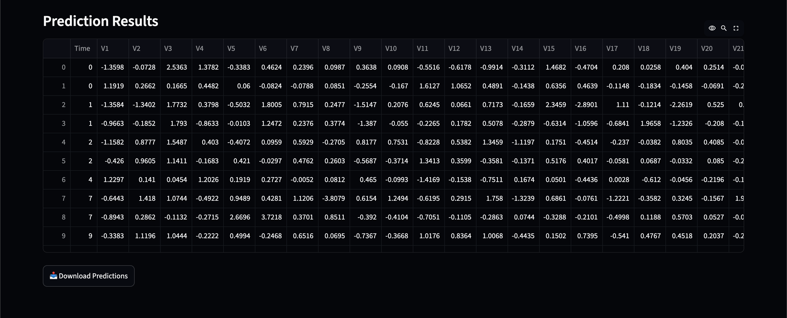
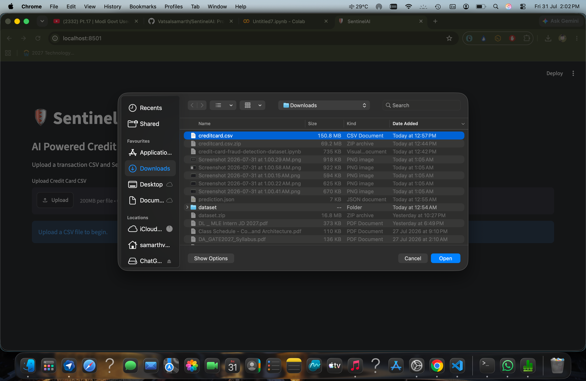

# 🛡️ SentinelAI

<div align="center">

# AI-Powered Credit Card Fraud Detection Platform

### Enterprise-grade Machine Learning platform for real-time credit card fraud detection using XGBoost, FastAPI, and Streamlit.


</div>

---

## 📖 Overview

SentinelAI is an end-to-end Machine Learning application that detects fraudulent credit card transactions in real time. The project demonstrates the complete ML lifecycle—from data preprocessing and model training to deployment through a FastAPI backend and an interactive Streamlit dashboard.

The model is trained on the highly imbalanced Credit Card Fraud Detection dataset using **SMOTE** for oversampling and **XGBoost** for classification, providing high-performance fraud detection with real-time inference capabilities.

### ✨ Key Highlights

- 🚀 End-to-end Machine Learning pipeline
- 🤖 XGBoost-based fraud detection model
- ⚖️ Handles class imbalance using SMOTE
- 🌐 FastAPI REST API for real-time predictions
- 📊 Interactive Streamlit dashboard
- 📂 Batch CSV transaction prediction
- 🔍 Single transaction prediction interface
- 📈 Model performance visualization
- 🐳 Dockerized deployment
- 🧩 Modular and production-ready project structure

## 📸 Application Walkthrough

### 🏠 Home Interface

<p align="center">
  
</p>

---

### 📂 Upload CSV

<p align="center">
  
</p>

---

### 📊 Analytics Dashboard

<p align="center">
  
</p>

---

### 📈 Fraud Probability Distribution

<p align="center">
  
</p>

---

### 📋 Prediction Results

<p align="center">
  
</p>

### 📈 Fraud Probability Distribution

<p align="center">
  
</p>
## 🎯 Features

- 🔍 Real-time credit card fraud detection
- 🤖 XGBoost-based machine learning model
- ⚖️ SMOTE for handling severe class imbalance
- 🌐 FastAPI REST API for inference
- 📊 Interactive Streamlit dashboard
- 📂 Batch prediction from CSV files
- 🧾 Single transaction prediction interface
- 📈 Performance metrics and visualizations
- 🐳 Docker support for easy deployment
- 🏗️ Modular, production-ready codebase
- 💾 Saved model and preprocessing pipeline
- 📚 Well-documented project structure

---
# 🏗️ System Architecture

```text
                    ┌──────────────────────────┐
                    │ Credit Card Transactions │
                    └─────────────┬────────────┘
                                  │
                                  ▼
                    ┌──────────────────────────┐
                    │ Data Preprocessing       │
                    │ • Cleaning               │
                    │ • Feature Scaling        │
                    │ • Train/Test Split       │
                    └─────────────┬────────────┘
                                  │
                                  ▼
                    ┌──────────────────────────┐
                    │ Handle Imbalanced Data   │
                    │ • SMOTE Oversampling     │
                    └─────────────┬────────────┘
                                  │
                                  ▼
                    ┌──────────────────────────┐
                    │ XGBoost Model Training   │
                    └─────────────┬────────────┘
                                  │
                                  ▼
                    ┌──────────────────────────┐
                    │ Model Evaluation         │
                    │ Accuracy • ROC • F1      │
                    └─────────────┬────────────┘
                                  │
                 ┌────────────────┴────────────────┐
                 ▼                                 ▼
       ┌──────────────────┐             ┌──────────────────┐
       │ FastAPI REST API │             │ Streamlit UI     │
       └──────────────────┘             └──────────────────┘
```

---

# 🛠️ Tech Stack

| Category | Technologies |
|-----------|--------------|
| **Programming Language** | Python 3.12 |
| **Machine Learning** | Scikit-learn, XGBoost |
| **Data Processing** | Pandas, NumPy |
| **Imbalanced Learning** | SMOTE (imbalanced-learn) |
| **Model Explainability** | SHAP |
| **Backend API** | FastAPI |
| **Frontend** | Streamlit |
| **Visualization** | Matplotlib, Plotly |
| **Model Serialization** | Joblib |
| **Containerization** | Docker, Docker Compose |

---

# 📂 Project Structure

```text
SentinelAI/
│
├── dashboard/
│   ├── components/
│   ├── pages/
│   ├── app.py
│   └── styles.css
│
├── images/
│
├── models/
│   ├── metrics.json
│   ├── xgboost_model.pkl
│   └── scaler.pkl
│
├── notebooks/
│
├── src/
│   ├── api/
│   │   └── main.py
│   ├── config.py
│   ├── evaluation.py
│   ├── predictor.py
│   ├── preprocessing.py
│   ├── trainer.py
│   └── utils.py
│
├── Dockerfile
├── docker-compose.yml
├── requirements.txt
├── LICENSE
└── README.md
```

---

# 🤖 Machine Learning Pipeline

The workflow followed in SentinelAI consists of the following stages:

1. Load the Credit Card Fraud Detection dataset.
2. Perform exploratory data analysis to understand class imbalance.
3. Split the dataset into training and testing sets.
4. Apply feature scaling using `StandardScaler`.
5. Balance the training data using **SMOTE**.
6. Train multiple machine learning models.
7. Select the best-performing **XGBoost** classifier.
8. Evaluate using classification metrics and ROC-AUC.
9. Save the trained model and scaler using Joblib.
10. Deploy the model through FastAPI and Streamlit.

---
# 📊 Dataset

The project uses the **Credit Card Fraud Detection** dataset from Kaggle.

| Property | Value |
|----------|-------|
| Total Transactions | 284,807 |
| Features | 30 |
| Target Column | Class |
| Fraudulent Transactions | 492 |
| Legitimate Transactions | 284,315 |
| Fraud Ratio | 0.1727% |

> **Note:** Due to GitHub's file size restrictions, the dataset is **not included** in this repository. Download it from Kaggle and place `creditcard.csv` inside the appropriate data directory before training.

---

# 🚀 Getting Started

## 1️⃣ Clone the Repository

```bash
git clone https://github.com/Vatsalsamarth/SentinelAI.git
cd SentinelAI
```

## 2️⃣ Create a Virtual Environment

### macOS / Linux

```bash
python3 -m venv .venv
source .venv/bin/activate
```

### Windows

```powershell
python -m venv .venv
.venv\Scripts\activate
```

---

## 3️⃣ Install Dependencies

```bash
pip install -r requirements.txt
```

---

# ▶️ Running the Project

## Start the FastAPI Server

```bash
uvicorn src.api.main:app --reload
```

API Documentation:

```
http://127.0.0.1:8000/docs
```

---

## Launch the Streamlit Dashboard

```bash
streamlit run dashboard/app.py
```

Dashboard:

```
http://localhost:8501
```

---

## 🐳 Run with Docker

Build the image:

```bash
docker build -t sentinelai .
```

Run the container:

```bash
docker run -p 8000:8000 sentinelai
```

Or use Docker Compose:

```bash
docker-compose up --build
```

---

# 🌐 REST API

| Method | Endpoint | Description |
|---------|----------|-------------|
| GET | `/` | Welcome endpoint |
| GET | `/health` | Health check |
| GET | `/model_info` | Model information |
| POST | `/predict` | Predict fraud for transaction(s) |

---

# 📊 Dashboard Features

The Streamlit dashboard provides multiple interfaces for interacting with the trained model.

### 🏠 Home

- Project overview
- Navigation panel
- Quick statistics

### 📈 Analytics Dashboard

- Fraud distribution
- Transaction analysis
- Interactive charts
- Model insights

### 📂 Batch Prediction

- Upload CSV files
- Predict thousands of transactions
- Download prediction results

### 🔍 Single Transaction Prediction

- Manual feature input
- Fraud probability score
- Instant prediction

### 📄 Model Information

- Model details
- Dataset summary
- Performance metrics
- Technology stack

---
# 📈 Model Performance

The XGBoost classifier was selected as the final model after evaluating multiple machine learning algorithms on the highly imbalanced credit card fraud dataset.

### Evaluation Metrics

| Metric | Description |
|---------|-------------|
| Accuracy | Overall prediction accuracy |
| Precision | Correctly identified fraudulent transactions |
| Recall | Ability to detect actual fraud cases |
| F1-Score | Balance between Precision and Recall |
| ROC-AUC | Overall model discrimination capability |

> Detailed evaluation metrics are available in `models/metrics.json`.

---

# 🚀 Future Improvements

The following enhancements can further improve SentinelAI:

- 📡 Real-time fraud detection using Apache Kafka
- ☁️ Cloud deployment on AWS, Azure, or GCP
- 📊 MLflow for experiment tracking and model versioning
- 🔄 CI/CD pipeline using GitHub Actions
- ☸️ Kubernetes deployment
- 📈 Real-time model monitoring and drift detection
- 🔐 JWT authentication for API security
- 📝 Prediction logging and audit trails

---

# 🤝 Contributing

Contributions are welcome!

If you'd like to improve SentinelAI:

1. Fork the repository.
2. Create a new feature branch.
3. Commit your changes.
4. Push your branch.
5. Open a Pull Request.

Please ensure your code follows good coding practices and includes appropriate documentation.

---

# 👨‍💻 Author

## Samarth Vatsal

**Computer Science Engineering (AI & ML)**

- 🔗 GitHub: https://github.com/Vatsalsamarth
- 💼 LinkedIn: https://www.linkedin.com/in/samarthvatsal/

---

# 📄 License

This project is licensed under the **MIT License**.

See the [LICENSE](LICENSE) file for more details.

---

<div align="center">

### ⭐ If you found this project useful, consider giving it a star!

Made with ❤️ using Python, FastAPI, Streamlit, and XGBoost.

</div>
